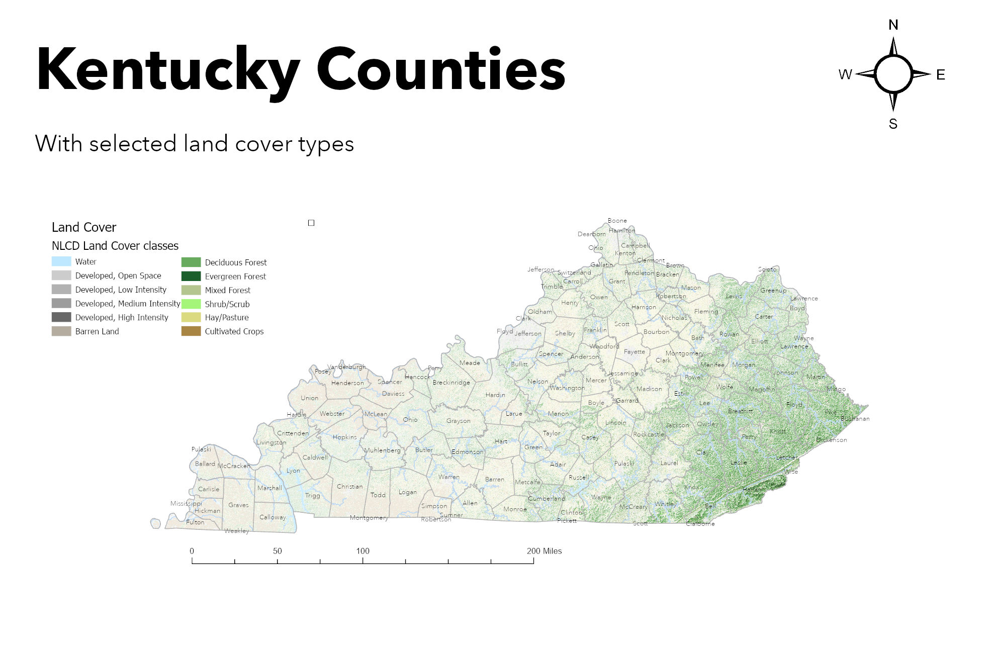
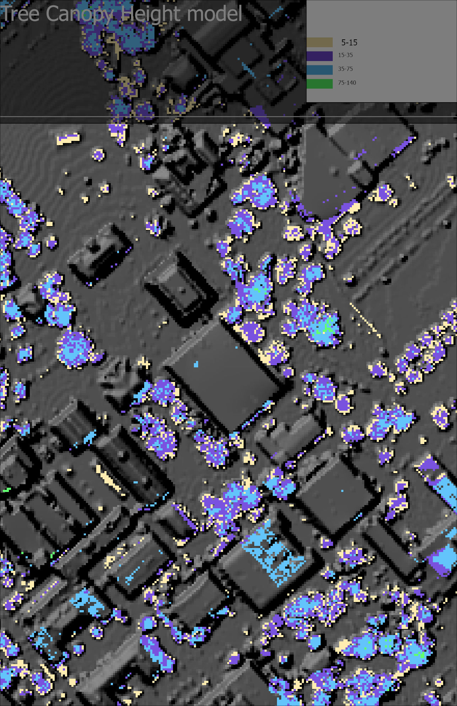

# geo409-fieldtripmaps
# GEO409 Field Trip Maps
Maps for field trip to measure tree canopy

   
Kentucky counties with selected land cover types – [Download geospatial PDF](Ky-Layout.pdf)

   
UKy central campus canopy model – [Download geospatial PDF](Layout2.pdf)

Maps created by Hollandsurveying for GEO409, Spring 2023, University of Kentucky Department of Geography
